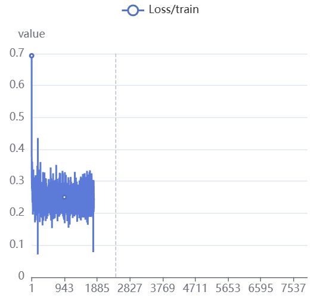
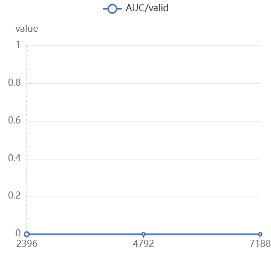
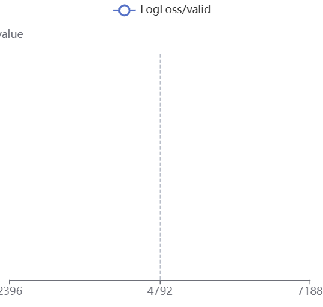

# v0.4 — PCVRInterFormer 训练报告（含 NaN 崩溃诊断与修复）

## 一、项目概述

v0.4 在 v0.3 的基础上进行了多项架构与数据处理变更，并在首次训练中遭遇了**训练中期 Loss 突变为 NaN** 的严重崩溃。本报告记录完整训练过程、根因分析以及已实施的修复方案。

### 代码结构

```
v0.4/
├── dataset.py       # Parquet 数据集加载（新增 time_order_split / log1p / sort_seq）
├── model.py         # PCVRInterFormer 模型定义
├── trainer.py       # 训练器（已修复 AMP + GradScaler 问题）
├── train.py         # 训练入口
├── utils.py         # 工具函数（sigmoid_focal_loss, EarlyStopping 等）
├── ns_groups.json   # 非序列特征分组配置（备用）
├── run.sh           # 启动脚本（RankMixer 模式）
├── Loss.png         # 训练集 Loss 曲线
├── AUC.png          # 验证集 AUC 曲线
├── LogLoss.png      # 验证集 LogLoss 曲线
├── 记录.txt          # 完整训练日志
└── Evaluation/      # 离线评估脚本
    ├── dataset.py
    ├── infer.py
    └── model.py
```

---

## 二、v0.3 → v0.4 变更总览

### 2.1 超参数对比表

| 参数 | v0.3 | v0.4 | 变更说明 |
|------|------|------|----------|
| `loss_type` | `focal` | **`bce`**（默认） | 切回 BCEWithLogitsLoss 以获得更稳定的梯度 |
| `batch_size` | 1024 | **384** | 缩小以适应更大模型 & 更长序列 |
| `interaction_backbone` | 无 | **`dhen`** | 新增 DHEN 交互骨干网络 |
| `interaction_layers` | -- | **2** | DHEN 交互层数 |
| `dcn_layers` | -- | **2** | DCN 交叉层数 |
| `cross_low_rank` | -- | **32** | DCN 低秩分解维度 |
| `num_cls_tokens` | 4 | 4 | 未调整 |
| `num_pma_tokens` | 2 | **2** | 新增 PMA token 数量 |
| `num_recent_tokens` | 2 | **2** | 新增最近行为 token |
| `seq_encoder_type` | `swiglu` | `swiglu` | 未调整 |
| `dropout_rate` | 0.01 | 0.01 | 未调整 |
| `ns_tokenizer_type` | `group` | **`rankmixer`** | 切换为 RankMixer tokenizer（无需 ns_groups.json） |
| `user_ns_tokens` | -- | **5** | 用户侧 NS token 数 |
| `item_ns_tokens` | -- | **5** | 物品侧 NS token 数 |
| `use_rope` | 无 | **启用** | 新增 RoPE 位置编码 |
| `time_order_split` | 无 | **启用** | 按时序切分训练/验证集 |
| `log_dense_fids` | 无 | **62,63,64,65,66** | 对统计类稠密特征做 log(1+x) 变换 |
| `sort_seq_domains` | 无 | **seq_d** | seq_d 域内按特征值排序 |
| `num_epochs` | 3 | **999** | 恢复长期训练 + EarlyStopping |
| `num_workers` | 4 | 4 | 未调整 |
| `buffer_batches` | 20 | 50 | 增大 shuffle buffer |

### 2.2 模型规模

| 指标 | 数值 |
|------|------|
| 总参数量 | **240,466,663** |
| 稀疏参数（Embedding） | 101 个张量，237,448,064 参数 |
| 稠密参数（Dense） | 289 个张量，3,018,599 参数 |
| 稀疏优化器 | Adagrad (lr=0.05) |
| 稠密优化器 | AdamW (lr=0.0001, betas=0.9/0.98) |
| d_model | 64 |
| num_heads | 4 |
| num_hyformer_blocks | 2 |
| 序列配置 | seq_a:256, seq_b:256, seq_c:512, seq_d:512 |

---

## 三、训练结果

### 3.1 总体情况

- **训练时间**：2026-05-07 02:29 → 14:20（约 12 小时）
- **训练步数**：约 2396 步（约 1 个 epoch），于 step 2396 保存 best_model
- **终止方式**：手动终止（因 Loss 突变为 NaN 后无法恢复）
- **最终 checkpoint**：`global_step2396.layer=2.head=4.hidden=64.best_model`

### 3.2 Loss 曲线分析



- **阶段一（Step 0 ~ 100）**：Loss 从 0.69 快速下降至 0.25 附近，模型快速收敛
- **阶段二（Step 100 ~ 1795）**：Loss 在 0.18 ~ 0.35 区间内震荡，整体稳定，无明显发散趋势
- **阶段三（Step 1795 ~ 终止）**：**Loss 突变为 NaN，此后所有 step 的 loss 恒为 NaN，不再恢复**

### 3.3 验证指标

 

- 验证 AUC 和 LogLoss 在图表中显示为 0 / inf
- 原因：`eval_every_n_steps=0`（未启用按步评估），仅在 epoch 结束时触发验证
- 由于训练在 epoch 1 中途被手动终止，未执行完整 epoch 验证
- 日志中 Epoch 1 和 Epoch 2 的验证输出 `AUC: 0.0, LogLoss: inf`，结合 `[Evaluate] 100783/100783 predictions are NaN` 可知：**模型权重已被 NaN 污染，输出的所有预测值均为 NaN**

---

## 四、崩溃根因分析

### 4.1 崩溃时间线

```
Step 1794  loss=0.2159  ← 一切正常
Step 1795  loss=0.2463  ← 最后一个正常 step
Step 1796  loss=nan     ← 从此万劫不复
... 此后所有 step 均为 NaN ...
```

### 4.2 根因：AMP (autocast) 未使用 GradScaler

**问题代码** (`trainer.py` 原始 `_train_step` 方法)：

```python
with torch.amp.autocast('cuda', enabled=use_amp):
    logits = self.model(model_input)
    ...
    loss = F.binary_cross_entropy_with_logits(logits, label)

loss.backward()   # ← FP16 梯度，未经缩放（Scale）
```

**崩溃机制**：

1. `torch.amp.autocast('cuda')` 将前向传播中的部分计算降为 **FP16（半精度）**
2. FP16 的表示范围极小：最小值约 $6\times10^{-8}$（下溢），最大值约 65504（上溢）
3. 多数 batch 的梯度恰好在 FP16 可表示范围之内 → 正常训练了 1795 步
4. 某个 batch 的激活值稍大，导致梯度超过 65504 → **上溢为 inf**
5. `optimizer.step()` 将 inf 写入权重 → **权重变 NaN**
6. 后续所有 forward 都输出 NaN → **永续传染，无法自愈**

### 4.3 排除的其他假设

| 假设 | 判断 |
|------|------|
| 稀疏 LR (0.05) 过高 | ❌ 次要因素——若为根因，训练早期即会发散，而非 1795 步后突变 |
| Log(1+x) 变换产生 NaN | ❌ 可能性低——若数据系统性含非法值，step 1 即会崩 |
| BCE/Focal Loss 公式不稳定 | ❌ `F.binary_cross_entropy_with_logits` 内含 log-sum-exp trick，FP32 下极稳定 |
| 梯度裁剪缺失 | ❌ **代码已有 `clip_grad_norm_(max_norm=1.0)`**，不缺失 |

> 🎯 **唯一根因**：AMP (autocast) + 缺失 `GradScaler`。

---

## 五、已实施的修复

### 5.1 添加 GradScaler（关键修复）

在 `trainer.py` 中进行了两处修改：

**① 初始化 Scaler** (第 73-74 行)：

```python
self.scaler = torch.amp.GradScaler('cuda') if device == 'cuda' else None
```

**② 重写反向传播与优化器更新逻辑**（`_train_step` 方法末尾）：

```python
if self.scaler is not None:
    self.scaler.scale(loss).backward()        # 放大 loss，防止 FP16 梯度下溢

    self.scaler.unscale_(self.dense_optimizer) # 解缩放，恢复真实梯度
    if self.sparse_optimizer is not None:
        self.scaler.unscale_(self.sparse_optimizer)

    torch.nn.utils.clip_grad_norm_(...)       # 梯度裁剪（在真实梯度上执行）

    self.scaler.step(self.dense_optimizer)     # Scaler 接管 optimizer.step()
    if self.sparse_optimizer is not None:
        self.scaler.step(self.sparse_optimizer)

    self.scaler.update()                       # 动态调整缩放因子
else:
    # CPU / 无 AMP 时的原始逻辑
    loss.backward()
    torch.nn.utils.clip_grad_norm_(...)
    self.dense_optimizer.step()
    ...
```

### 5.2 建议的防御性增强（未强制实施）

| 措施 | 优先级 | 说明 |
|------|--------|------|
| `--sparse_lr 0.01` 替代 `0.05` | ★★★ | 降低稀疏参数学习率，提升训练稳定性 |
| `np.maximum(x, -0.999)` 保护 log1p | ★★☆ | 防止极少数脏数据导致 log1p 计算 `-inf` |
| `--eval_every_n_steps 1000` 启用按步验证 | ★★★ | 避免长时间不验证 / 不存 checkpoint |
| `--time_order_split False` | ★★☆ | 如果最后 10% 数据无标签，需关闭时序切分 |

---

## 六、如何复现

### 6.1 环境要求

- Python 3.10+
- PyTorch 2.x (CUDA 支持)
- 依赖：`numpy`, `pandas`, `pyarrow`, `scikit-learn`, `tqdm`, `tensorboard`

### 6.2 启动训练

```bash
cd v0.4
bash run.sh
```

或通过额外参数覆盖默认配置：

```bash
bash run.sh --sparse_lr 0.01 --eval_every_n_steps 1000
```

### 6.3 从 checkpoint 恢复

```bash
bash run.sh --resume_from global_step2396.layer=2.head=4.hidden=64.best_model
```

---

## 七、经验教训

1. **AMP 必须配对 GradScaler**：`torch.amp.autocast` 只负责前向混合精度，反向传播必须通过 `GradScaler` 对 loss 进行缩放，否则 FP16 的狭窄表示范围极易引发梯度溢出。
2. **NaN 一旦出现不会自愈**：FP16 溢出产生的 inf/NaN 会通过权重更新永久污染模型参数，不存在"过几个 step 自己恢复"的可能——必须重启或从健康 checkpoint 恢复。
3. **按步验证 + 早停很重要**：`eval_every_n_steps=0` 导致训练中途无验证信号，如果开启了按步验证（如每 1000 步），可以在 NaN 发生后的第一个验证点及时触发早停，避免浪费算力。
4. **排查 NaN 时的常见误区**：容易第一时间怀疑 learning rate / 数据 / loss 函数，但如果在代码中看到了 `autocast` 而没有 `GradScaler`，**这就是最高优先级的嫌疑对象**。

---

## 八、文件清单

| 文件 | 说明 |
|------|------|
| `train.py` | 训练入口，解析命令行参数 |
| `trainer.py` | 训练器（**已修复 AMP + GradScaler**） |
| `model.py` | PCVRInterFormer 模型定义 |
| `dataset.py` | Parquet 数据加载（time_order_split / log1p / sort_seq） |
| `utils.py` | sigmoid_focal_loss, EarlyStopping |
| `run.sh` | 启动脚本 |
| `记录.txt` | 完整训练日志（含 NaN 崩溃记录） |
| `Loss.png` / `AUC.png` / `LogLoss.png` | 训练曲线图 |
| `Evaluation/` | 离线评估脚本 |
